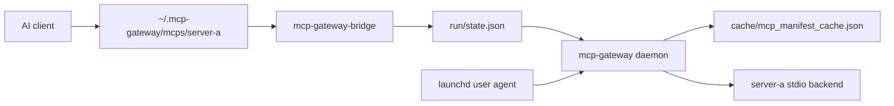

# MCP Gateway

MCP Gateway is a lightweight, host-native Rust supervisor for MCP servers on macOS. It runs as a user LaunchAgent, keeps one private loopback-only HTTP control plane, exposes each configured backend through its own stdio shim in `~/.mcp-gateway/mcps/<server>`, lazy-starts backends only when tools are called, and stops idle backends after 20 minutes by default.

## Why MCP Gateway?

- Avoid one MCP backend process per AI client process.
- Lazy-start backend servers when agents actually call tools.
- Keep the daemon control plane private on `127.0.0.1` or `::1`.
- Generate per-server shims for supported clients instead of exposing a visible parent `mcp-gateway` MCP.
- Serve `initialize`, `tools/list`, `prompts/list`, and `resources/list` from a capability cache so agent startup does not start every backend.



## Binaries

- `mcp-gateway`: the local supervisor daemon.
- `mcp-gateway-bridge`: the stdio bridge executed by each per-server shim.
- `mcpgateway`: installer, config helper, capability refresher, doctor, and status CLI.

## Requirements

- macOS. The daemon is intentionally a host-native user service, not a Docker-first or cross-platform daemon.
- A stable Rust toolchain for source builds.
- `pnpm` or `npx` only when installing Node-backed MCP servers or provisioning Chrome for Testing.

## Install From Source

```bash
cargo build --release --workspace --bins
target/release/mcpgateway install-native
```

Fresh installs are empty-core: no default MCP servers, no default managed AI clients, no API keys, and no browser sessions. The installer writes the neutral LaunchAgent at:

```text
~/Library/LaunchAgents/io.github.mcpgateway.daemon.plist
```

It preserves existing user config and migrates the old private label best-effort if present.

## First Server Quickstart

The package below is a fake example. Replace it with an MCP package you trust.

```bash
mcpgateway install @example/fake-mcp-server --name example-tools --arg=--stdio
mcpgateway import-clients --write
mcpgateway apply-configs --clients codex,claude-code
mcpgateway refresh-capabilities all
mcpgateway ps
```

Client configs point to `~/.mcp-gateway/mcps/example-tools`. They do not hard-code the daemon port, and they do not add a visible aggregate `mcp-gateway` MCP entry.

## Configuration

Primary config lives at `~/.mcp-gateway/config/gateway.yaml`. User-installed server overlays live in `~/.mcp-gateway/config/servers.d/*.yaml`.

Important paths:

- `~/.mcp-gateway/bin/`: installed Rust binaries.
- `~/.mcp-gateway/mcps/<server>`: executable per-server shims.
- `~/.mcp-gateway/run/state.json`: owner-only state file containing the hidden daemon URL.
- `~/.mcp-gateway/env`: owner-only environment file for values referenced by config.
- `~/.mcp-gateway/cache/mcp_manifest_cache.json`: cached tools, prompts, and resources.
- `~/.mcp-gateway/logs/`: daemon stdout/stderr logs from launchd.

Configuration supports stdio backends, groups, managed clients, environment expansion with `${NAME}`, backend timeouts, message limits, `lazy`, `singleton`, and `dangerous` flags. See [docs/configuration.md](docs/configuration.md).

## Safety Model

- The daemon refuses non-loopback listen addresses by default.
- Browser-originated requests from non-local origins are rejected; CLI and bridge requests without `Origin` are allowed.
- `state.json` and `env` are written owner-only because they can expose private local state or secrets.
- Backend logs exposed through `/logs/{server}` are redacted for common secret patterns and configured secret values.
- `dangerous: true` marks backends that can inspect or mutate sensitive local state; it is not a sandbox.
- Browser MCP servers are opt-in. They must not default to the user's regular Chrome profile; Chrome for Testing provisioning is explicit.

## Common Commands

```bash
mcpgateway doctor
mcpgateway ps
mcpgateway stop example-tools
mcpgateway stop all
mcpgateway refresh-capabilities all
```

## Troubleshooting

- Gateway not running: run `mcpgateway doctor`, inspect `launchctl print gui/$UID/io.github.mcpgateway.daemon`, then rerun `mcpgateway install-native`.
- `pnpm` missing: install it only if you are adding Node-backed MCP servers.
- Capability cache missing: run `mcpgateway refresh-capabilities all`.
- Client cannot find a shim: rerun `mcpgateway apply-configs --clients <client>` and verify `~/.mcp-gateway/mcps/<server>` exists.
- Stale launchd service: rerun `mcpgateway install-native`, which unloads the old label best-effort and writes the neutral label.

More detail is in [docs/troubleshooting.md](docs/troubleshooting.md).

## Development

```bash
cargo fmt --all
cargo clippy --workspace --all-targets -- -D warnings
cargo test --workspace
cargo build --release --workspace --bins
```

The workspace is GitHub-release-only for now. Crates are marked `publish = false` until the crates.io packaging strategy is intentionally revisited.

## Limitations

- macOS is the supported host-native install target.
- Backend support is stdio-focused today.
- Release binaries are not signed or notarized yet.
- No default MCP servers or managed AI clients are installed.

## Documentation

- [Architecture](docs/architecture.md)
- [Configuration](docs/configuration.md)
- [Client integrations](docs/client-integrations.md)
- [Security](docs/security.md)
- [Troubleshooting](docs/troubleshooting.md)
- [Release process](docs/release.md)
