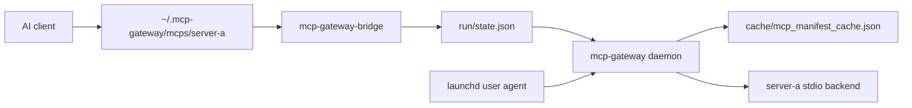

# MCP Gateway

MCP Gateway is a lightweight, host-native macOS supervisor for MCP servers. It runs as a user LaunchAgent, keeps a private loopback-only control plane, exposes each configured backend through a per-server stdio shim in `~/.mcp-gateway/mcps/<server>`, serves discovery from a cache, and lazy-starts backends only for real tool calls.

Fresh installs are empty-core: no default MCP servers, no default managed AI clients, no API keys, and no browser sessions.

## Install

### GitHub Release

Download the archive for your Mac from [GitHub Releases](https://github.com/vgorb0v/mcp-gateway/releases), then install the binaries:

```bash
tar -xzf mcp-gateway-vX.Y.Z-aarch64-apple-darwin.tar.gz
cd mcp-gateway-vX.Y.Z-aarch64-apple-darwin
./mcpgateway install-native
```

Use the `x86_64-apple-darwin` archive on Intel Macs. The installer writes binaries and shims under `~/.mcp-gateway/` and the user LaunchAgent at:

```text
~/Library/LaunchAgents/io.github.mcpgateway.daemon.plist
```

### Homebrew

A Homebrew tap is planned but not published yet.

### Build From Source

```bash
cargo build --release --workspace --bins
target/release/mcpgateway install-native
```

## 90-Second Demo

Run a self-contained proof path without adding real MCP packages or touching launchctl:

```bash
mcpgateway demo
```

From a source checkout:

```bash
make demo
```

The demo uses a temporary home, installs the local binaries with `--skip-launchctl`, writes a temporary `demo-tools` overlay, refreshes cached capabilities, starts the daemon directly, and exercises `initialize`, `tools/list`, and `tools/call` through the generated shim.

Use `mcpgateway demo --keep` to keep the temporary files for inspection.

## First Real Server

Install a package you trust, then refresh capabilities:

```bash
mcpgateway add @modelcontextprotocol/server-filesystem --name filesystem --arg="$HOME/Documents"
mcpgateway refresh all
mcpgateway ps
```

`mcpgateway add` is an alias for `mcpgateway install`. It writes a single-server overlay under `~/.mcp-gateway/config/servers.d/` and does not make the server available to clients until you apply or manage client configs.

## Client Integration

Client configs point to:

```text
~/.mcp-gateway/mcps/<server>
```

The shim calls `mcp-gateway-bridge`, which reads `~/.mcp-gateway/run/state.json`; client configs do not hard-code daemon ports and do not add a visible aggregate `mcp-gateway` MCP entry.

```bash
mcpgateway import-clients --write
mcpgateway apply-configs --clients codex,claude-code
mcpgateway doctor
```

Supported adapters are optional conveniences: Codex, Claude Code, Claude Desktop, VS Code, and Antigravity.

## Troubleshooting

```bash
mcpgateway doctor
mcpgateway status
mcpgateway stop <server>
mcpgateway stop all
mcpgateway refresh all
```

- Gateway not running: inspect `mcpgateway doctor`, then rerun `mcpgateway install-native`.
- Capability cache missing or stale: run `mcpgateway refresh all`.
- Client cannot find a shim: rerun `mcpgateway apply-configs --clients <client>` and verify the shim exists.
- Browser MCP server using the wrong browser: stop it immediately and reprovision Chrome for Testing explicitly with `mcpgateway install-native --provision chrome-for-testing`.

More detail is in [docs/troubleshooting.md](docs/troubleshooting.md).

## Architecture



The binaries are:

- `mcp-gateway`: local supervisor daemon.
- `mcp-gateway-bridge`: per-server stdio bridge executed by shims.
- `mcpgateway`: installer, config helper, capability refresher, doctor, status, and demo CLI.

Configuration lives at `~/.mcp-gateway/config/gateway.yaml`; user-installed server overlays live in `~/.mcp-gateway/config/servers.d/*.yaml`.

See [docs/architecture.md](docs/architecture.md), [docs/configuration.md](docs/configuration.md), and [docs/security.md](docs/security.md).

## Development

```bash
make check
make smoke
make demo
make ci
```

Useful one-offs:

```bash
cargo fmt --all -- --check
cargo clippy --workspace --all-targets -- -D warnings
cargo test --workspace
cargo build --release --workspace --bins
```

The project is GitHub-release-only for now. Crates are marked `publish = false` until the crates.io packaging strategy is intentionally revisited.

## Limitations

- macOS is the supported host-native install target.
- Backend support is stdio-focused today.
- Release binaries are not signed or notarized yet.
- No default MCP servers or managed AI clients are installed.
