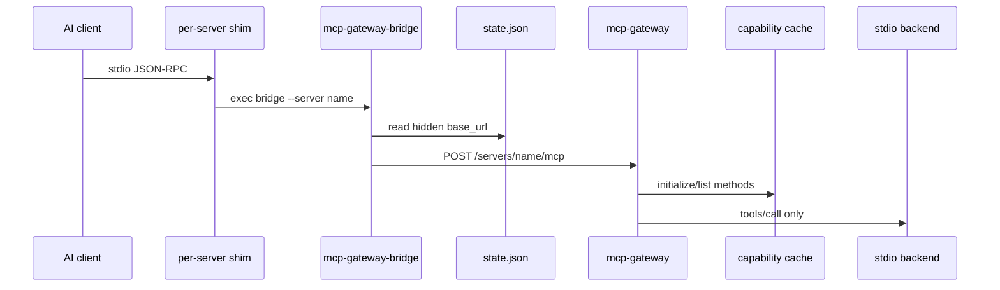

# Architecture

MCP Gateway is a macOS user service composed of three binaries:

- `mcp-gateway`: daemon and private loopback HTTP control plane.
- `mcp-gateway-bridge`: stdio bridge invoked by generated per-server shims.
- `mcpgateway`: installer, config reconciler, capability refresher, doctor, and status CLI.



## Daemon

The daemon binds to a loopback address from `listen`, normally `127.0.0.1:0`, and writes the selected URL to `~/.mcp-gateway/run/state.json`. The port is intentionally hidden from client configs.

The daemon owns backend lifecycle, health, logs, sessions, cached capability responses, and lazy startup.

## Bridge and Shims

Each configured server gets a shim at `~/.mcp-gateway/mcps/<server>`. Supported AI clients run those shims directly. The shim launches `mcp-gateway-bridge`, which reads `state.json` and forwards MCP JSON-RPC to the daemon.

This keeps clients AI-client agnostic and avoids a visible aggregate `mcp-gateway` MCP entry.

## Request Flow

- `initialize`: answered by the gateway with gateway/server metadata.
- `tools/list`, `prompts/list`, `resources/list`: answered from `mcp_manifest_cache.json` when cache mode is enabled.
- `tools/call`: routed to the owning backend, lazy-starting that backend if needed.
- Notifications: forwarded to running backends or bridge sessions as appropriate.

## User Service

Homebrew installs use the formula `service` block and are managed with `brew services start/stop mcp-gateway`. Standalone source or GitHub release installs can still use `mcpgateway install`, which writes a user LaunchAgent at `~/Library/LaunchAgents/io.github.mcpgateway.daemon.plist`.

Both service paths start the daemon with the config, env file, state file, and cache file paths under `~/.mcp-gateway`.

## Capability Cache

The cache stores public tools, prompts, resources, server info, generation time, and a config fingerprint. It intentionally excludes server env keys and values.

Refresh it with:

```bash
mcpgateway refresh-capabilities all
```

Refresh may briefly start backends and stops backends that were not already running.
